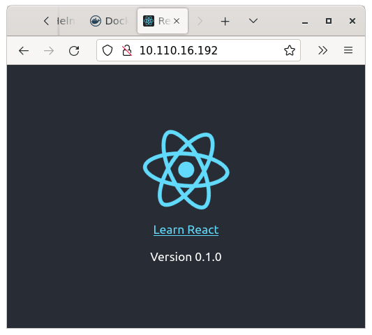
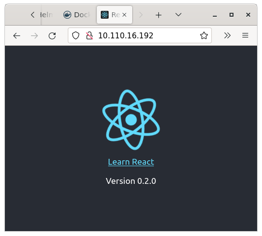

# Create a New chart

## Instructions

- [ ] Open a terminal and navigate to the `create-chart` directory (the one with this file).

- [ ] Using the [helm create](https://helm.sh/docs/helm/helm_create/) command, create a chart named `hello-react`. 

- [ ] Copy the command you used, and the output generated and paste it below:

```
paste the command and output here
```

- [ ] In the `Chart.yaml` file, change the `appVersion` to "0.1.0".

- [ ] In the `values.yaml` file, change the `image.repository` property to "datadaddy/react-demo".

Helm will combine these two values to generate an `image` value of `"datadaddy/react-demo:0.1.0"` in the `templates/deployment.yaml` file when Helm runs. Verify this behavior by running the following command:

```
helm install test-release hello-react --dry-run | grep image
```

- [ ] Verify the output is as follows:
```
      image: busybox
          image: "datadaddy/react-demo:0.1.0"
          imagePullPolicy: IfNotPresent
```

- [ ] In the `values.yaml` file, change the `service.type` property to `LoadBalancer`.

- [ ] Using the [helm install](https://helm.sh/docs/helm/helm_install/) command, install the chart using a release name of `react-release` without overriding any parameters.

- [ ] Copy the command you used, and the output generated and paste it below:

```
paste the command and output here
```

- [ ] Verify your chart is installed using the `helm ls` command.

- [ ] In a separate terminal window, run `minikube tunnel` supplying your password when prompted to allocate an external IP for the load balancer.

- [ ] Verify the external IP is allocated using `kubectl get svc`

- [ ] Copy the external IP address and past it into your browser to verify it display version 0.1.0 of the application:



- [ ] Run the [helm history](https://helm.sh/docs/helm/helm_history/) command to see the history of your release,

- [ ] Copy the command you used, and the output generated and paste it below:

```
paste the command and output here
```

- [ ] Before moving to the next step, record details of the release by running the following command:
```
helm get all react-release > v0.1.0-outut.txt
```

- [ ] View the new file and make sure it has around 160 lines of output, and the top few lines look similar to this:
    ```
    NAME: react-release
    LAST DEPLOYED: Mon Mar 21 13:05:46 2022
    NAMESPACE: helm
    STATUS: deployed
    REVISION: 1
    USER-SUPPLIED VALUES:
    null

    COMPUTED VALUES:
    affinity: {}
    ```

## Upgrade the app to a new release:

- [ ] In the `Chart.yaml` file, change the `appVersion` to "0.2.0".

- [ ] Use the [helm upgrade](https://helm.sh/docs/helm/helm_upgrade/) command to rollout the new version.

- [ ] Copy the command you used, and the output generated and paste it below:

```
paste the command and output here
```

- [ ] Verify your chart is installed using the `helm ls` command.

- [ ] Refresh your browser and verify the release now shows as 0.2.0. __NOTE:__ you may need to restart the `minikube tunnel` command if the refresh doesn't work.



- [ ] Run the [helm history](https://helm.sh/docs/helm/helm_history/) command to see the history of your release,

- [ ] Copy the command you used, and the output generated and paste it below:

```
paste the command and output here
```

- [ ] Before moving to the next step, record details of the release by running the following command:
```
helm get all react-release > v0.2.0-outut.txt
```

- [ ] View the new file and make sure it has around 160 lines of output, and the top few lines look similar to this:
    ```
    NAME: react-release
    LAST DEPLOYED: Mon Mar 21 13:22:11 2022
    NAMESPACE: helm
    STATUS: deployed
    REVISION: 2
    USER-SUPPLIED VALUES:
    null

    COMPUTED VALUES:
    affinity: {}
    ```

## Roll back the release

- [ ] Using the [helm rollback](https://helm.sh/docs/helm/helm_rollback/) command, roll back to revision 1.

- [ ] Copy the command you used, and the output generated and paste it below:

```
paste the command and output here
```

- [ ] Run the [helm history](https://helm.sh/docs/helm/helm_history/) command to see the history of your release,

- [ ] Copy the command you used, and the output generated and paste it below:

```
paste the command and output here
```

- [ ] Refresh your browser and verify the release now shows as 0.1.0. __NOTE:__ you may need to restart the `minikube tunnel` command if the refresh doesn't work. 

## Uninstall your chart

- [ ] Use the [helm uninstall](https://helm.sh/docs/helm/helm_uninstall/) command to uninstall your chart.

- [ ] Copy the command you used, and the output generated and paste it below:

```
paste the command and output here
```

- [ ] Go back to the terminal window where you have `minikube tunnel` running and press `Ctrl` + `C` to stop the tunnel providing your password if prompted.

## Next up

* Complete Part 1: [Install the Bitnami Wordpress chart using custom values](../wordpress/README.md) if you haven't already done so.
* After completing both parts, prepare your work for submission using the procedures in the main [README file](../README.md).